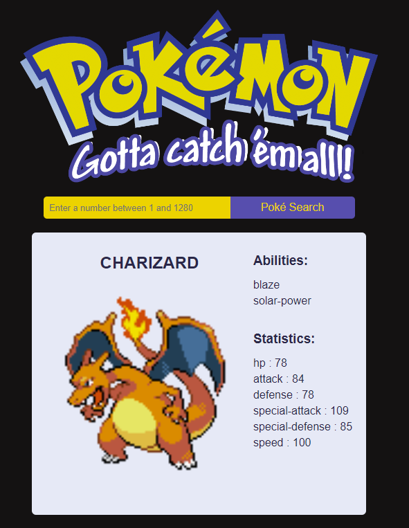

# Get Pokémon

> A simple website that allows the user to get a pokémon by id.

## Table of contents

- [Get Pokémon](#get-pokémon)
  - [Table of contents](#table-of-contents)
  - [General info](#general-info)
  - [Screenshots](#screenshots)
  - [Technologies](#technologies)
  - [Setup](#setup)
  - [Code Examples](#code-examples)
  - [Status](#status)

## General info

> The objective of the project is to practice using get requests and apply
> separation of concerns.

## Screenshots



## Technologies

- JavaScript
- HTML5
- CSS3
- VS Code

## Setup

Clone the repo and run npm install.

## Code Examples

```js
const createStatisticsList = (stats) => {
	const list = document.createElement('ul');
	list.id = 'stat-list';

	stats.forEach((stat) => {
		const item = document.createElement('li');
		item.innerText = `${stat.stat.name} : ${stat.base_stat}`;

		list.append(item);
	});
	return list;
};

export default createStatisticsList;
```

## Status

Project is: _done_
